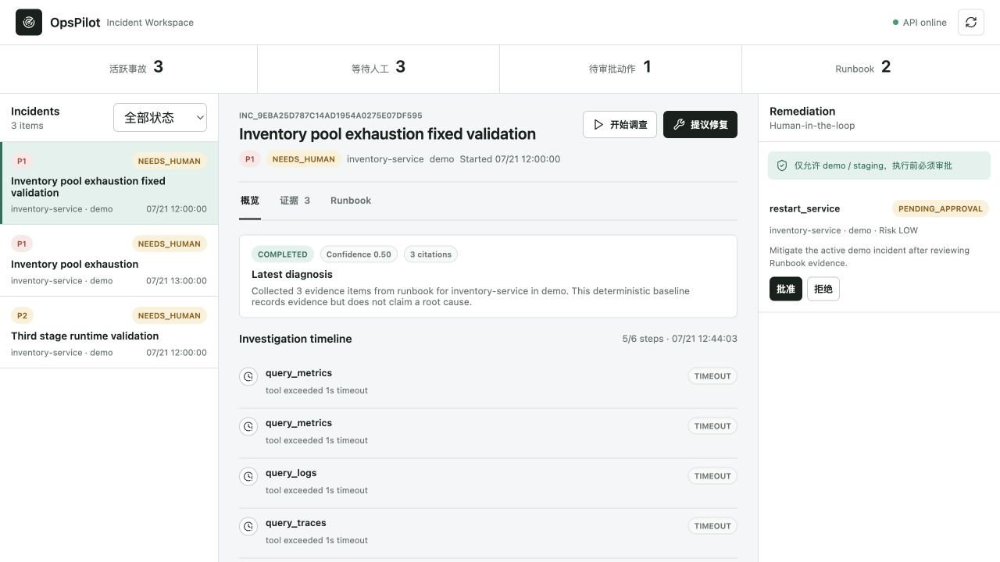
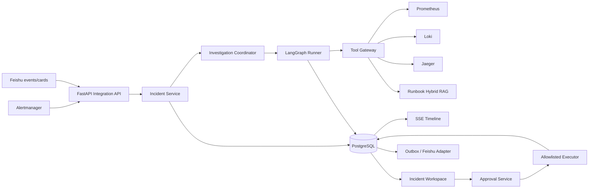
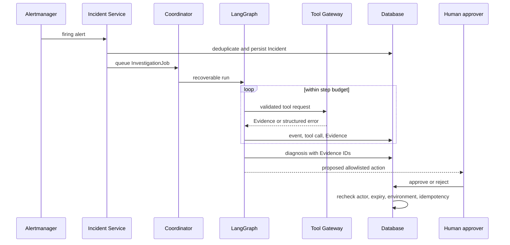

# OpsPilot

[](https://github.com/Plz12111/opspilot/actions/workflows/ci.yml)
[](https://www.python.org/)
[](compose.yml)

OpsPilot 是一个面向微服务故障响应的证据驱动 AI SRE Incident Agent。它接收 Alertmanager 或飞书事件，按显式状态图查询 Metrics、Logs、Traces 和 Runbook，输出可追溯的诊断，并把修复动作限制在服务端白名单与人工审批之后。

它不是一个把告警转发给大模型的聊天机器人。项目重点是 Agent 工程中的状态、工具、证据、恢复、评测和安全边界。



## 项目结果

| 维度 | 当前结果 |
| --- | ---: |
| 离线评测案例 | 80 个，覆盖 10 类根因 |
| Root cause Top-1 | 67.5% -> 93.8%（+26.2pp） |
| Root cause Top-3 | 97.5% |
| Citation validity | 100% |
| Critical evidence recall | 100% |
| Tool success rate | 98.5% |
| Prohibited action rate | 0% |
| 三次重复运行 Top-1 / Top-3 一致性 | 100% / 100% |
| 自动化测试 | 66 passed |
| Docker 韧性测试 | 50 并发 / 415 请求 / 6 场景全部通过 |
| 订单链路基线 | 721.59 RPS，P95 94.86 ms（本机 Compose） |

评测结果由 `make eval` 从固定数据集自动生成，不手工填写。当前成本是基于 Evidence 字符数的 Token 代理指标，不是模型供应商账单。完整报告见 [评测基线](docs/evaluation-baseline.md)。

## 快速导航

| 想了解什么 | 入口 |
| --- | --- |
| 系统如何拆分 | [架构图与关键决策](docs/architecture.md) |
| 如何在 5 分钟内启动 | [快速启动](#5-分钟运行演示) |
| 如何运行测试 | [测试命令与报告](#测试命令与报告) |
| Benchmark 是否可信 | [Benchmark 环境与口径](#benchmark-环境与口径) |
| 80 个案例如何生成 | [评测集构造方式](docs/evaluation-dataset.md) |
| Agent 调查界面 | [核心功能截图](#核心功能截图) |

## 为什么值得做

一次线上告警通常需要在多个系统之间切换：确认影响、查指标、搜索日志、定位 Trace、阅读 Runbook、判断变更风险，再与值班人员协作。OpsPilot 把这条链路变成可恢复的工作流，同时保留三个边界：

- 结论必须引用本次调查产生的 Evidence ID。
- 数据源内容一律视为不可信输入，不能覆盖系统策略。
- Agent 只能提出动作；服务端策略、审批人权限和幂等执行共同决定动作能否发生。

## 系统架构



数据库是 Incident、调查任务、证据、审批和执行记录的系统真相。飞书与 Web Workspace 都是适配器；调查协程中断后，应用会从数据库恢复未完成任务。详细设计见 [系统架构与决策](docs/architecture.md)。

## 一次调查如何运行



当前在线 Workspace 默认使用确定性总结器：它只报告已收集的数据源与限制，不会在证据不足时伪造根因。`EvidenceGroundedSynthesizer` 已定义结构化模型接口，可替换成真实模型 Provider；任何 Provider 输出仍需经过 Pydantic 与 CitationValidator。离线 v1/v2 是在相同 80 案例轨迹上运行的可解释诊断基线。

## 核心工程能力

- **显式 Agent 状态图**：计划、执行、总结节点，步骤预算与结构化状态。
- **安全工具网关**：Pydantic 参数、白名单、超时、结果截断、标准化错误。
- **证据约束**：Metrics、Logs、Traces、Runbook 统一为带来源和校验值的 Evidence。
- **持久异步执行**：`202 Accepted`、数据库 Job、启动恢复、SSE 回放和 `Last-Event-ID`。
- **Runbook RAG**：Markdown 分块、关键词/向量检索、RRF 重排与引用。
- **受控修复**：仅 demo/staging、审批人 allowlist、禁止自批、过期与幂等锁。
- **生产型集成**：Alertmanager 去重、飞书验签/幂等、Outbox 和互动卡片。
- **并发与韧性**：原子告警计数、调查幂等键、修复 exactly-once、故障注入与 P50/P95/P99 报告。
- **可重复评测**：固定数据摘要、失败案例保留、候选对照、稳定性和成本代理。
- **可部署性**：Alembic、Docker Compose、健康检查、演示种子和 CI 容器冒烟。

## 5 分钟运行演示

要求 Docker Desktop 已启动：

```bash
make demo-up
make demo-seed
make smoke
make resilience-test
```

`make demo-seed` 只调用公开 HTTP API，幂等创建一条完整流程：Runbook 导入、告警去重、Agent 调查、证据持久化、人工审批和受控执行。命令会输出可直接打开的 Incident 深链接。

主要入口：

- Workspace：`http://127.0.0.1:8000/`
- OpenAPI：`http://127.0.0.1:8000/docs`
- Demo Gateway：`http://127.0.0.1:8080/docs`
- Prometheus：`http://127.0.0.1:9090`
- Alertmanager：`http://127.0.0.1:9093`
- Jaeger：`http://127.0.0.1:16686`

完整环境复现和排障见 [部署与演示手册](docs/deployment-demo.md)。
高并发场景、业务不变量和实测报告见 [高并发与韧性验证](docs/resilience-testing.md)。

## 测试命令与报告

| 命令 | 验证范围 | 报告 |
| --- | --- | --- |
| `make lint` | Ruff 静态检查与格式 | 命令行门禁 |
| `make test` | 66 项单元/集成/迁移测试 | 85.57% 覆盖率基线 |
| `make eval` | 80 案例 Agent 离线评测与三次稳定性验证 | [对照报告](evals/reports/incident-comparison.md) |
| `make smoke` | live/ready、Workspace、OpenAPI、Evaluation API | 容器冒烟结果 |
| `make resilience-quick` | CI 规模并发、幂等和依赖恢复 | [韧性报告](evals/reports/resilience-latest.md) |
| `make resilience-test` | 50 并发、415 个业务请求、六场景 | [JSON 报告](evals/reports/resilience-latest.json) |

完整覆盖率命令：

```bash
PYTHONPATH=src uv run pytest -q \
  --cov=opspilot --cov-report=term-missing --cov-fail-under=80
```

GitHub Actions 同时运行代码质量、独立镜像冒烟和完整 Compose 韧性测试；任一业务不变量失败都会使 CI 返回非零状态。

## Benchmark 环境与口径

| 项目 | 口径 |
| --- | --- |
| 测试时间 | 2026-07-22 |
| 环境 | ARM64 macOS，Docker Engine 29.6.1，单机 Docker Compose |
| 服务拓扑 | OpsPilot + PostgreSQL + Redis + Gateway/Order/Inventory + Prometheus/Loki/Jaeger/Alertmanager，共 10 个容器 |
| OpsPilot 部署 | 单 Uvicorn 进程，PostgreSQL 持久卷，测试前检查 ready 状态 |
| 压测客户端 | `httpx.AsyncClient`，50 并发连接，无人为 think time |
| 时延统计 | 客户端端到端耗时；P50/P95/P99 使用 nearest-rank |
| 吞吐统计 | 场景完成请求数 / 场景墙钟时间，不包含环境启动时间 |
| 通过条件 | HTTP 状态符合预期且 Incident/Run/Action/Execution 等业务不变量全部成立 |

该结果用于证明本机 Compose 下的并发正确性和性能基线，**不是生产 SLA 或多实例容量承诺**。完整场景、故障清理策略和限制见 [高并发与韧性验证](docs/resilience-testing.md)。

## 评测集构造方式

评测集由 **30 个手工策划案例 + 50 个系统化变体**组成，覆盖 10 类根因。每个案例显式记录标准根因、关键 Evidence ID、工具观测结果、故障工具和禁止动作；变体覆盖跨来源佐证、单日志信号、Runbook 噪声、遥测缺失及歧义证据。

```bash
make eval-dataset  # 从 cases-v1.json 重建固定的 80 案例 cases.json
make eval          # 在相同数据摘要与工具轨迹上对比 v1/v2
```

数据 Schema、生成矩阵、防数据泄漏策略和评分口径见 [评测集构造说明](docs/evaluation-dataset.md)。

## 核心功能截图


截图展示 Incident 聚合、Agent 调查时间线、Evidence 引用、Runbook 和 Human-in-the-loop 修复区域。完整演示操作顺序见 [5 分钟视频脚本](docs/demo-video-script.md)。

## 本地开发

要求 Python 3.12+ 与 [uv](https://docs.astral.sh/uv/)：

```bash
make install
make migrate
make dev
make test
make lint
make eval
```

版本化迁移是正式 schema 入口；`OPSPILOT_DB_AUTO_CREATE` 默认关闭。测试环境显式使用 SQLite 自动建表以缩短反馈时间。

## 故障演练

Compose 中包含 `Gateway -> Order -> Inventory` 三个服务以及 Prometheus、Loki、Jaeger。以下脚本会注入故障、持续产生流量并自动复位：

```bash
sh demo/scenarios/inventory-error.sh
sh demo/scenarios/inventory-latency.sh
```

故障接口只接受有界参数和 `X-Fault-Token`，不接受任意 Shell。详见 [演练环境](docs/demo-environment.md)。

## 安全边界与已知限制

- Production 修复被策略层明确禁止；当前 `DemoActionExecutor` 不连接真实 Kubernetes 或发布系统。
- `X-Actor-Id` 仅用于本地演示；真实部署必须由认证中间件注入身份。
- 在线默认总结器是确定性安全基线；仓库没有宣称真实模型已经上线。
- 当前协调器面向单实例演示；多实例需要数据库租约或外部队列实现任务抢占。
- Docker Compose 默认凭据只适用于本机，不应直接暴露公网。
- Docker Compose 已在 PostgreSQL、Redis、Prometheus、Loki、Jaeger 和三服务演练环境上完成本机运行验证；CI 另含独立镜像构建和容器冒烟门禁。

## 文档导航

- [系统架构与关键决策](docs/architecture.md)
- [调查引擎](docs/investigation-engine.md)
- [Runbook RAG](docs/runbook-rag.md)
- [受控修复与审批](docs/remediation-workflow.md)
- [飞书集成](docs/feishu-integration.md)
- [Incident Workspace](docs/incident-workspace.md)
- [离线评测](docs/evaluation-baseline.md)
- [评测集构造说明](docs/evaluation-dataset.md)
- [部署与演示](docs/deployment-demo.md)
- [高并发与韧性验证](docs/resilience-testing.md)
- [5 分钟视频脚本](docs/demo-video-script.md)
- [简历与面试讲解](docs/interview-guide.md)
- [项目计划与完成记录](docs/project-plan.md)
