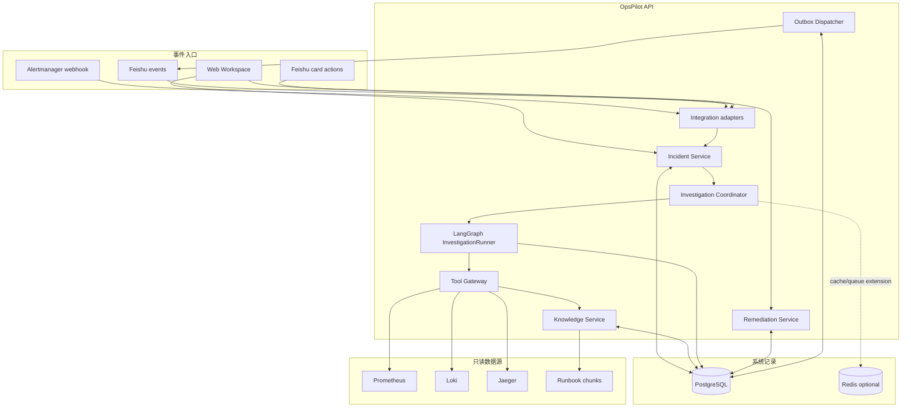
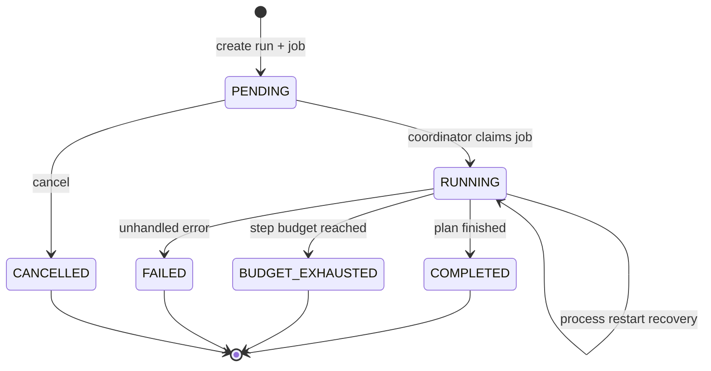
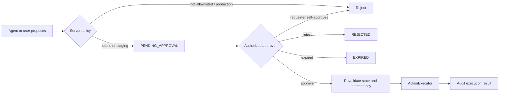

# OpsPilot 系统架构与关键决策

## 架构目标

OpsPilot 优先解决四类 Agent 工程问题：长流程如何恢复、工具结果如何成为可信证据、高风险动作如何脱离模型控制、效果如何在同一数据集上比较。系统保持 Python 单体仓库，用包边界、事务和接口隔离职责，避免为了展示技术提前拆分服务。

## 运行时视图



PostgreSQL 保存完整状态，Redis 与观测后端不可用时系统可以降级查看已有 Incident。`/health/ready` 会把核心依赖和可选依赖分开报告。

## 领域所有权

| 模块 | 拥有的规则 | 不负责 |
| --- | --- | --- |
| Incident Service | 告警指纹、活跃 Incident 去重、生命周期 | 选择调查工具 |
| Investigation Coordinator | Job 排队、恢复、协程生命周期 | 生成诊断内容 |
| InvestigationRunner | 状态图、预算、工具顺序、Evidence 汇总 | 直接操作数据库或 Shell |
| Tool Gateway | Schema、白名单、超时、截断、错误标准化 | 决定根因 |
| Knowledge Service | 分块、Embedding、混合检索、RRF | 执行修复 |
| Remediation Service | 策略、审批、过期、幂等、执行状态 | 信任客户端声明的权限 |
| Notification Service | Outbox 重试、飞书消息适配 | 保存业务真相 |
| Evaluation Runner | 固定数据回放、确定性评分、报告 | 修改线上 Incident |

## Investigation 数据流



每次状态变化同时形成递增的 `RunEvent`。SSE 先回放数据库事件，再推送新增事件；客户端用 `Last-Event-ID` 或 `after` 恢复游标。应用启动时扫描 `PENDING/RUNNING` Job；运行结果已进入终态则只修正 Job，不重复工具调用。已经明确失败的运行保留失败状态，当前版本不会无限自动重试。

## 证据与模型边界

所有工具返回统一 Evidence：`id`、`source_type`、`source_uri`、`content`、`attributes/checksum`。诊断必须引用同一次运行中的 Evidence ID；引用未知 ID 或高置信度但无引用时，`CitationValidator` 拒绝结果。

```text
untrusted source -> validated tool -> Evidence -> structured synthesis
                 -> CitationValidator -> persisted diagnosis
```

当前默认 `RuleBasedDiagnosisSynthesizer` 是保守基线。真实模型通过 `StructuredDiagnosisProvider` 接口接入，只获得裁剪后的 Incident 与 Evidence，并输出固定 Pydantic Schema。模型不持有执行凭据，也不能构造任意工具或 Shell 命令。

## 修复安全模型



安全性由确定性服务端代码保证，而不是 Prompt：动作类型和目标环境白名单、独立参数 Schema、审批人 allowlist、禁止自批、审批有效期、数据库唯一约束和按动作锁。

## 关键架构决策

### ADR-001：单 Agent 状态图，不采用自由协作多 Agent

故障调查需要可重放、可预算和可解释。固定状态图更容易对工具轨迹做离线评分，也能清楚说明失败发生在哪个节点。只有当评测证明单图在并行假设验证上成为瓶颈时，才考虑多 Agent。

### ADR-002：数据库是系统记录

飞书、SSE 和 Workspace 都可能断线或重复投递。Incident、Job、Event、Evidence、Approval 全部落库，使适配器可以重试，应用可以恢复，演示也不依赖某个浏览器或聊天会话。

### ADR-003：模型提议，策略执行

Prompt 无法承担权限边界。模型输出只是一份结构化建议；执行前重新验证动作类型、环境、参数、审批身份、过期时间和幂等状态。

### ADR-004：先固定评测，再优化基线

数据集摘要相同才允许比较。v1 与 v2 复用相同 80 个案例和工具轨迹，保留五个 Top-1 失败案例。这样 `+26.2pp` 表示算法差异，而不是换了更容易的数据。

### ADR-005：保持模块化单体

当前吞吐量和团队规模不需要 Kafka 或额外微服务。单仓库减少部署成本，同时通过包边界、Protocol、事务与 Outbox 保留未来拆分点。

## 失败模式

| 故障 | 系统行为 |
| --- | --- |
| 重复 Alertmanager 事件 | external ID 幂等；同指纹合并到活跃 Incident |
| Metrics/Logs/Traces 不可用 | 工具记录结构化失败；其余工具继续；诊断列出限制 |
| 调查进程中断 | Job 与事件保留；启动扫描恢复 |
| SSE 断线 | 客户端携带最后序号回放，不丢事件 |
| 重复飞书回调 | provider/tenant/event ID 唯一约束阻止重复副作用 |
| 重复审批或执行 | 返回已有结果或冲突，不产生第二次执行 |
| Evidence 中包含指令 | 按不可信数据处理，不进入系统策略层 |
| 请求 production 修复 | 服务端策略直接拒绝 |

## 扩展路径

- 接入真实模型 Provider，并在现有 80 案例上与 v2 比较准确率、成本和波动。
- 为多实例 Coordinator 增加数据库租约或 Dramatiq/Redis worker。
- 实现只读部署历史与 Git Diff 工具，补充发布相关证据。
- 将 `ActionExecutor` 替换为受限 Kubernetes/发布平台适配器，并加入真实身份认证。
- 增加 OpenTelemetry/Langfuse 的模型调用 Token 与供应商账单指标。
